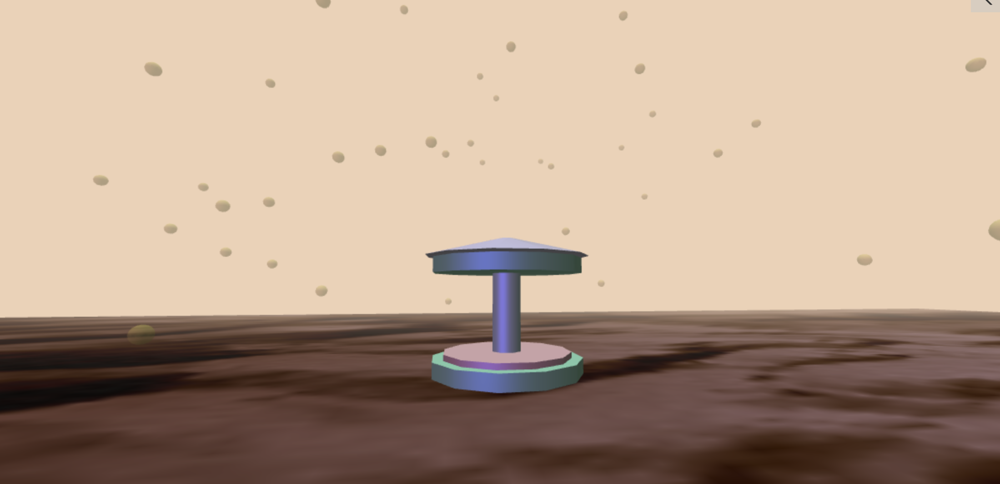

# Amusement Park in Ruins

Links to MIMIC: [AmusementParkinRuins](https://mimicproject.com/code/c380d551-f82d-32f8-87b0-5d4981d582be) 
Building a weird 3d amusement park in the cyber world has long become my passion.
I do not want it to be like what they are in the real commercial one, that cute and adorable.
I want it to be present at some strange scenes, like the piece I am working on, on a ruins-like soil, in a immersive fog.
I want it to miss some parts, like the carousel keeping rotating, but all the horses on it have escaped...(I might draw one left on the carousel in the future)
I also want to explore more structure of those toys in the amusement park, and paint them my colors.

I shall say frankly that this piece is not finished, because I encountered a bunch of problems to solve. Before stating about the problems, I might begin with what I achieved.

About the scene background, I do not use skybox this time, although I know that using skybox, I could add some reflection in the material of those flying bubbles. 
This is because I could not find a proper skybox image to use as my background. So I just use the fog effect as my background. And I do satisfied with this kind of style of *blade runner 2049*.

Then comes to those 3d objects which form into the core part of the carousel. I put them into a group and have tried different way of materials. After allocating them in proper position, I let them rotate in the central of my ground. I give the carousel three lights, one from the sky, simulating the sun, one ambient light and one from camera position, which is a dim purple light to better the atmosphere.

Then I use the for loop to create a group of bubbles flying in the screen. I give them a transparent effect.

In terms of the ground. I decided to use the canvas as my material to mesh with the PlaneGeometry. I firstly create my 2D canvas, and using imageData to adjust the RGBA values of the pixels. And I play with those value to create the texture showing now. I also refer to some example on the internet about how to define the texture of the geometry using wrapS and WrapT. But I failed to create this so far just because I have no idea why the system always tell me my ‘position is undefined’ when I want to read the built-in value, like ‘geometry.attribute.position.array’. Thus I could not make changes on the depth of my plane geometry. Although I tried the height function based on a noise. (Src: https://gist.github.com/mrdoob/518916).

Another problem I encounter is about my shader. I could not combine my shader and Three.js codes together. When I attempt to use my pre-write shader as my material to mesh with the ground. It cannot work and tell me ‘resolution is undefined’ again…after trying for so many times, I decided to use canvas as my material as shown.

I hope I could fix these problems step by step in the vacation time…
The outcome is bit far from my imagination, but I shall move forward.
